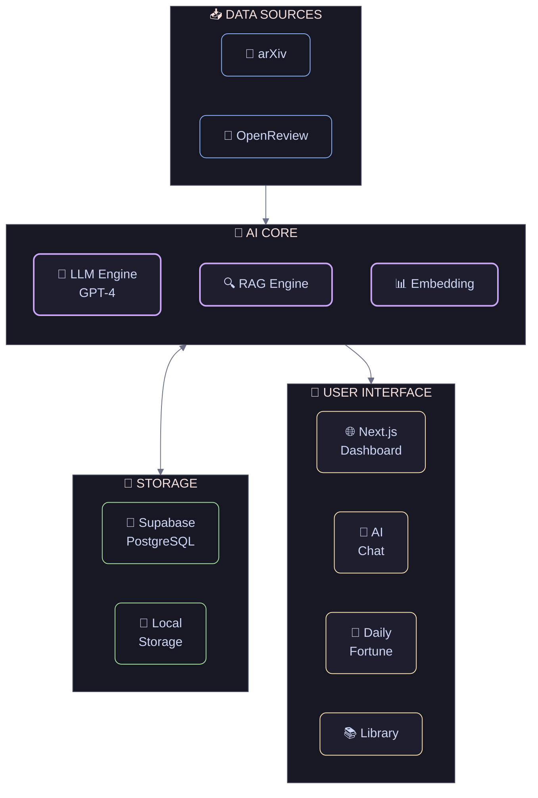

<div align="center">

# Paper Pulse

### AI-Powered Research Companion

*A new way to discover, read, and understand academic research.*

---

<p align="center">
  <a href="https://github.com/Otter-Knight/paper-pulse">
    
  </a>
  <a href="https://nextjs.org">
    
  </a>
  <a href="https://www.typescriptlang.org">
    
  </a>
</p>

</div>

---

<br>

<div align="center">

## From now on, research is no longer lonely.

<div style="
  background: linear-gradient(135deg, #667eea 0%, #764ba2 100%);
  border-radius: 24px;
  padding: 48px 32px;
  margin: 32px 0;
  color: white;
  text-align: center;
  box-shadow: 0 20px 60px rgba(102, 126, 234, 0.3);
">

  <h2 style="
    font-size: 28px;
    font-weight: 600;
    margin: 0 0 16px 0;
    letter-spacing: -0.5px;
  ">
    Every day, thousands of papers are published worldwide
  </h2>

  <p style="
    font-size: 16px;
    opacity: 0.9;
    margin: 0;
    line-height: 1.6;
  ">
    Facing the information flood, have you ever felt lost?<br>
    Paper Pulse was born for this moment.<br>
    Not just a reference manager, but your<br>
    <strong>intelligent companion</strong> and <strong>muse of inspiration</strong> on the research journey.
  </p>

</div>

</div>

---

<br>

<div align="center">

## Features

</div>

<div style="
  display: grid;
  grid-template-columns: repeat(auto-fit, minmax(320px, 1fr));
  gap: 24px;
  margin: 32px 0;
">

<!-- Paper Discovery -->
<div style="
  background: #1a1a2e;
  border-radius: 20px;
  padding: 32px;
  border: 1px solid rgba(255,255,255,0.08);
  transition: all 0.3s ease;
">
  <div style="font-size: 40px; margin-bottom: 16px;">📚</div>
  <h3 style="
    font-size: 20px;
    font-weight: 600;
    color: #fff;
    margin: 0 0 12px 0;
  ">Paper Discovery</h3>
  <p style="
    font-size: 14px;
    color: rgba(255,255,255,0.6);
    line-height: 1.7;
    margin: 0;
  ">
    Aggregating papers from <strong>arXiv</strong> and <strong>OpenReview</strong>,
    with intelligent filtering—every paper relevant to you appears automatically.
  </p>
</div>

<!-- Personalized Recommendations -->
<div style="
  background: #1a1a2e;
  border-radius: 20px;
  padding: 32px;
  border: 1px solid rgba(255,255,255,0.08);
  transition: all 0.3s ease;
">
  <div style="font-size: 40px; margin-bottom: 16px;">🎯</div>
  <h3 style="
    font-size: 20px;
    font-weight: 600;
    color: #fff;
    margin: 0 0 12px 0;
  ">Personalized Recommendations</h3>
  <p style="
    font-size: 14px;
    color: rgba(255,255,255,0.6);
    line-height: 1.7;
    margin: 0;
  ">
    Describe your research interests in natural language, and AI generates
    <strong>preference tag cards</strong> for you. No more cold algorithms—just an academic companion that truly understands you.
  </p>
</div>

<!-- AI Assistant -->
<div style="
  background: linear-gradient(135deg, #f093fb 0%, #f5576c 100%);
  border-radius: 20px;
  padding: 32px;
  border: none;
  transition: all 0.3s ease;
  box-shadow: 0 20px 40px rgba(245, 87, 108, 0.25);
">
  <div style="font-size: 40px; margin-bottom: 16px;">🤖</div>
  <h3 style="
    font-size: 20px;
    font-weight: 600;
    color: #fff;
    margin: 0 0 12px 0;
  ">AI Assistant</h3>
  <p style="
    font-size: 14px;
    color: rgba(255,255,255,0.9);
    line-height: 1.7;
    margin: 0;
  ">
    No need to read the entire paper—ask questions directly.<br>
    From cryptic formulas to core insights,<br>
    <strong>all answers are within reach</strong>.
  </p>
</div>

<!-- Personal Library -->
<div style="
  background: #1a1a2e;
  border-radius: 20px;
  padding: 32px;
  border: 1px solid rgba(255,255,255,0.08);
  transition: all 0.3s ease;
">
  <div style="font-size: 40px; margin-bottom: 16px;">📖</div>
  <h3 style="
    font-size: 20px;
    font-weight: 600;
    color: #fff;
    margin: 0 0 12px 0;
  ">Personal Library</h3>
  <p style="
    font-size: 14px;
    color: rgba(255,255,255,0.6);
    line-height: 1.7;
    margin: 0;
  ">
    Carefully curated papers, intelligently organized into
    <strong>Deep Reading</strong> and <strong>Quick Scan</strong> zones.
    Highlights and annotations—let your thoughts leave a mark.
  </p>
</div>

<!-- Daily Fortune -->
<div style="
  background: linear-gradient(135deg, #fa709a 0%, #fee140 100%);
  border-radius: 20px;
  padding: 32px;
  border: none;
  transition: all 0.3s ease;
  box-shadow: 0 20px 40px rgba(254, 225, 64, 0.25);
">
  <div style="font-size: 40px; margin-bottom: 16px;">✨</div>
  <h3 style="
    font-size: 20px;
    font-weight: 600;
    color: #1a1a2e;
    margin: 0 0 12px 0;
  ">Daily Fortune</h3>
  <p style="
    font-size: 14px;
    color: rgba(26, 26, 46, 0.8);
    line-height: 1.7;
    margin: 0;
  ">
    Research needs a little serendipity sometimes.<br>
    Draw a <strong>research fortune</strong> every day—<br>
    maybe inspiration and good vibes will follow.
  </p>
</div>

<!-- Smart Tags -->
<div style="
  background: #1a1a2e;
  border-radius: 20px;
  padding: 32px;
  border: 1px solid rgba(255,255,255,0.08);
  transition: all 0.3s ease;
">
  <div style="font-size: 40px; margin-bottom: 16px;">🏷️</div>
  <h3 style="
    font-size: 20px;
    font-weight: 600;
    color: #fff;
    margin: 0 0 12px 0;
  ">Smart Tags</h3>
  <p style="
    font-size: 14px;
    color: rgba(255,255,255,0.6);
    line-height: 1.7;
    margin: 0;
  ">
    Describe your research direction in natural language, AI generates refined candidate tags.
    Create up to <strong>10 preference tag cards</strong> to precisely track every paper you care about.
  </p>
</div>

</div>

---

<br>

<div align="center">

## Deep Reading & Export

<div style="
  background: linear-gradient(135deg, #1e1e2e 0%, #2a2a3e 100%);
  border-radius: 24px;
  padding: 40px;
  margin: 24px 0;
  border: 1px solid rgba(255,255,255,0.08);
  text-align: left;
">

### 💭 Let Your Thoughts Be Remembered

<p style="color: rgba(255,255,255,0.6); font-size: 15px; line-height: 1.8; margin-bottom: 32px;">
  Every research paper is a conversation with knowledge.<br/>
  Those flashes of insight deserve to be captured with care.
</p>

---

#### 📝 Immersive Annotations

<div style="display: grid; grid-template-columns: 1fr 1fr; gap: 24px; margin-top: 24px;">

<div>
  <p style="color: rgba(255,255,255,0.8); font-size: 14px; font-weight: 500; margin-bottom: 8px;">
    🎨 Five Colors
  </p>
  <p style="color: rgba(255,255,255,0.5); font-size: 13px;">
    Yellow, Pink, Blue, Green, Purple<br/>
    Color-code your thoughts
  </p>
</div>

<div>
  <p style="color: rgba(255,255,255,0.8); font-size: 14px; font-weight: 500; margin-bottom: 8px;">
    📍 Position Tags
  </p>
  <p style="color: rgba(255,255,255,0.5); font-size: 13px;">
    Beginning · End<br/>
    Pinpoint your insights
  </p>
</div>

</div>

---

#### 💡 Reading Summary

<p style="color: rgba(255,255,255,0.6); font-size: 14px; margin-top: 24px;">
  A dedicated space to capture the core ideas and your reflections
</p>

---

#### 📤 Export — Your Choice, Your Control

<div style="
  background: rgba(0,0,0,0.2);
  border-radius: 16px;
  padding: 24px;
  margin-top: 24px;
">

| Option | Description |
|:---:|:---|
| 🔘 **Pure Version** | Export paper only, no annotations |
| ✅ **Full Version** | Notes + Summary, all included |

<p style="color: rgba(255,255,255,0.5); font-size: 12px; margin-top: 16px; text-align: center;">
  Elegant toggle options at export<br/>
  Preserve the original paper, yet keep your thinking
</p>

</div>

</div>

</div>

---

<br>

<div align="center">

## Architecture



<div style="
  display: flex;
  flex-wrap: wrap;
  justify-content: center;
  gap: 32px;
  margin-top: 32px;
">

<div style="text-align: center;">
  <div style="font-size: 32px;">⚡</div>
  <div style="color: rgba(255,255,255,0.8); font-size: 12px; margin-top: 4px;">Next.js 16</div>
</div>

<div style="text-align: center;">
  <div style="font-size: 32px;">🛡️</div>
  <div style="color: rgba(255,255,255,0.8); font-size: 12px; margin-top: 4px;">TypeScript</div>
</div>

<div style="text-align: center;">
  <div style="font-size: 32px;">🎨</div>
  <div style="color: rgba(255,255,255,0.8); font-size: 12px; margin-top: 4px;">Tailwind</div>
</div>

<div style="text-align: center;">
  <div style="font-size: 32px;">🧠</div>
  <div style="color: rgba(255,255,255,0.8); font-size: 12px; margin-top: 4px;">OpenAI</div>
</div>

<div style="text-align: center;">
  <div style="font-size: 32px;">💾</div>
  <div style="color: rgba(255,255,255,0.8); font-size: 12px; margin-top: 4px;">Supabase</div>
</div>
</div>

<div style="text-align: center;">
  <div style="font-size: 48px;">📦</div>
  <div style="color: rgba(255,255,255,0.8); font-size: 14px; margin-top: 8px;">Zustand</div>
  <div style="color: rgba(255,255,255,0.4); font-size: 12px;">State Management</div>
</div>

</div>

<div style="
  border-top: 1px solid rgba(255,255,255,0.1);
  padding-top: 24px;
  color: rgba(255,255,255,0.5);
  font-size: 13px;
">
  Powered by <strong style="color: #fff;">Vercel AI SDK</strong> · Streaming Responses · Server Actions
</div>

</div>

</div>

---

<br>

<div align="center">

## Quick Start

</div>

```bash
# Clone the repository
git clone https://github.com/Otter-Knight/paper-pulse.git
cd paper-pulse

# Install dependencies
npm install

# Copy environment configuration
cp .env.example .env

# Start development server
npm run dev
```

<div style="
  background: rgba(102, 126, 234, 0.1);
  border: 1px solid rgba(102, 126, 234, 0.3);
  border-radius: 12px;
  padding: 20px 32px;
  margin: 24px 0;
  display: inline-block;
">
  <span style="color: rgba(255,255,255,0.7);">
    🧪 In development mode, no database required—mock data is used by default
  </span>
</div>

---

<br>

<div align="center">

## Embark on Your Research Journey

<div style="
  margin: 32px 0;
">
  <a href="https://github.com/Otter-Knight/paper-pulse/fork" style="
    display: inline-block;
    background: linear-gradient(135deg, #667eea 0%, #764ba2 100%);
    color: white;
    padding: 16px 40px;
    border-radius: 50px;
    text-decoration: none;
    font-weight: 600;
    font-size: 16px;
    box-shadow: 0 10px 30px rgba(102, 126, 234, 0.4);
    transition: all 0.3s ease;
  ">
    ⭐ Star on GitHub
  </a>
</div>

<p style="
  color: rgba(255,255,255,0.4);
  font-size: 14px;
  margin-top: 24px;
">
  Made with ❤️ by <a href="https://github.com/Otter-Knight" style="color: #667eea;">Otter-Knight</a>
</p>

</div>

---

<div align="center">

<p style="color: rgba(255,255,255,0.3); font-size: 12px;">
  LICENSE: MIT · Paper Pulse © 2024
</p>

</div>
