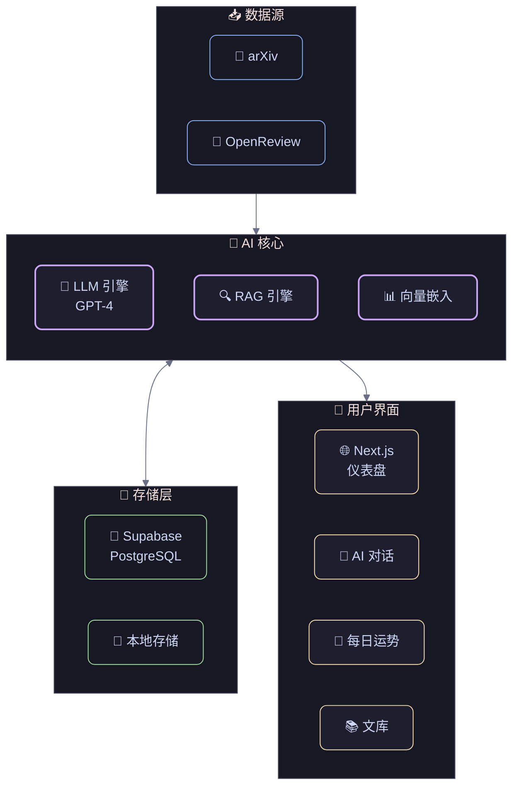

<div align="center">

# Paper Pulse

### AI 驱动的学术论文助手

*发现、阅读、理解学术论文的全新方式*

---

<p align="center">
  <a href="https://github.com/Otter-Knight/paper-pulse">
    
  </a>
  <a href="https://nextjs.org">
    
  </a>
  <a href="https://www.typescriptlang.org">
    
  </a>
</p>

</div>

---

<br>

<div align="center">

## 从此，科研不再孤单。

<div style="
  background: linear-gradient(135deg, #667eea 0%, #764ba2 100%);
  border-radius: 24px;
  padding: 48px 32px;
  margin: 32px 0;
  color: white;
  text-align: center;
  box-shadow: 0 20px 60px rgba(102, 126, 234, 0.3);
">

  <h2 style="
    font-size: 28px;
    font-weight: 600;
    margin: 0 0 16px 0;
    letter-spacing: -0.5px;
  ">
    每一天，全球数千篇论文发表
  </h2>

  <p style="
    font-size: 16px;
    opacity: 0.9;
    margin: 0;
    line-height: 1.6;
  ">
    面对信息洪流，你是否也曾感到迷失？<br>
    Paper Pulse，应运而生。<br>
    不是简单的文献管理器，而是你科研路上的<br>
    <strong>智能伙伴</strong>与<strong>灵感缪斯</strong>。
  </p>

</div>

</div>

---

<br>

<div align="center">

## 功能亮点

</div>

<div style="
  display: grid;
  grid-template-columns: repeat(auto-fit, minmax(320px, 1fr));
  gap: 24px;
  margin: 32px 0;
">

<!-- 论文发现 -->
<div style="
  background: #1a1a2e;
  border-radius: 20px;
  padding: 32px;
  border: 1px solid rgba(255,255,255,0.08);
  transition: all 0.3s ease;
">
  <div style="font-size: 40px; margin-bottom: 16px;">📚</div>
  <h3 style="
    font-size: 20px;
    font-weight: 600;
    color: #fff;
    margin: 0 0 12px 0;
  ">论文发现</h3>
  <p style="
    font-size: 14px;
    color: rgba(255,255,255,0.6);
    line-height: 1.7;
    margin: 0;
  ">
    汇聚 <strong>arXiv</strong> 与 <strong>OpenReview</strong> 的海量论文，
    配合智能筛选，让每一篇与你相关的文献，自动浮现眼前。
  </p>
</div>

<!-- 个性化推荐 -->
<div style="
  background: #1a1a2e;
  border-radius: 20px;
  padding: 32px;
  border: 1px solid rgba(255,255,255,0.08);
  transition: all 0.3s ease;
">
  <div style="font-size: 40px; margin-bottom: 16px;">🎯</div>
  <h3 style="
    font-size: 20px;
    font-weight: 600;
    color: #fff;
    margin: 0 0 12px 0;
  ">个性化推荐</h3>
  <p style="
    font-size: 14px;
    color: rgba(255,255,255,0.6);
    line-height: 1.7;
    margin: 0;
  ">
    用自然语言描述你的研究兴趣，AI 将为你生成专属的
    <strong>偏好标签卡</strong>。从此，论文推荐不再是冰冷的算法，而是懂你的学术知己。
  </p>
</div>

<!-- AI 助手 -->
<div style="
  background: linear-gradient(135deg, #f093fb 0%, #f5576c 100%);
  border-radius: 20px;
  padding: 32px;
  border: none;
  transition: all 0.3s ease;
  box-shadow: 0 20px 40px rgba(245, 87, 108, 0.25);
">
  <div style="font-size: 40px; margin-bottom: 16px;">🤖</div>
  <h3 style="
    font-size: 20px;
    font-weight: 600;
    color: #fff;
    margin: 0 0 12px 0;
  ">AI 助手</h3>
  <p style="
    font-size: 14px;
    color: rgba(255,255,255,0.9);
    line-height: 1.7;
    margin: 0;
  ">
    无需通读全文，直接向论文提问。<br>
    从晦涩的公式到核心观点，<br>
    <strong>一切答案，触手可及</strong>。
  </p>
</div>

<!-- 个人文库 -->
<div style="
  background: #1a1a2e;
  border-radius: 20px;
  padding: 32px;
  border: 1px solid rgba(255,255,255,0.08);
  transition: all 0.3s ease;
">
  <div style="font-size: 40px; margin-bottom: 16px;">📖</div>
  <h3 style="
    font-size: 20px;
    font-weight: 600;
    color: #fff;
    margin: 0 0 12px 0;
  ">个人文库</h3>
  <p style="
    font-size: 14px;
    color: rgba(255,255,255,0.6);
    line-height: 1.7;
    margin: 0;
  ">
    精心收藏的论文，智能划分为<strong>精读区</strong>与<strong>速读区</strong>。
    高亮、批注，让你的思考留下痕迹。
  </p>
</div>

<!-- 每日运势 -->
<div style="
  background: linear-gradient(135deg, #fa709a 0%, #fee140 100%);
  border-radius: 20px;
  padding: 32px;
  border: none;
  transition: all 0.3s ease;
  box-shadow: 0 20px 40px rgba(254, 225, 64, 0.25);
">
  <div style="font-size: 40px; margin-bottom: 16px;">✨</div>
  <h3 style="
    font-size: 20px;
    font-weight: 600;
    color: #1a1a2e;
    margin: 0 0 12px 0;
  ">每日运势</h3>
  <p style="
    font-size: 14px;
    color: rgba(26, 26, 46, 0.8);
    line-height: 1.7;
    margin: 0;
  ">
    科研路上偶尔需要一点小确幸。<br>
    每日抽一支<strong>科研运势签</strong>，<br>
    或许灵感和好心情，就此降临。
  </p>
</div>

<!-- 智能标签 -->
<div style="
  background: #1a1a2e;
  border-radius: 20px;
  padding: 32px;
  border: 1px solid rgba(255,255,255,0.08);
  transition: all 0.3s ease;
">
  <div style="font-size: 40px; margin-bottom: 16px;">🏷️</div>
  <h3 style="
    font-size: 20px;
    font-weight: 600;
    color: #fff;
    margin: 0 0 12px 0;
  ">智能标签</h3>
  <p style="
    font-size: 14px;
    color: rgba(255,255,255,0.6);
    line-height: 1.7;
    margin: 0;
  ">
    用自然语言描述你的研究方向，AI 智能生成细分的候选词。
    最多可创建 <strong>10 个偏好标签卡</strong>，精准锁定你关心的每一篇论文。
  </p>
</div>

</div>

---

<br>

<div align="center">

## 深度阅读与自由导出

<div style="
  background: linear-gradient(135deg, #1e1e2e 0%, #2a2a3e 100%);
  border-radius: 24px;
  padding: 40px;
  margin: 24px 0;
  border: 1px solid rgba(255,255,255,0.08);
  text-align: left;
">

### 💭 让思考，有迹可循

<p style="color: rgba(255,255,255,0.6); font-size: 15px; line-height: 1.8; margin-bottom: 32px;">
  在科研路上，每一篇论文都是一次与知识的对话。<br/>
  那些灵光一现的想法，值得被认真记录。
</p>

---

#### 📝 沉浸式批注

<div style="display: grid; grid-template-columns: 1fr 1fr; gap: 24px; margin-top: 24px;">

<div>
  <p style="color: rgba(255,255,255,0.8); font-size: 14px; font-weight: 500; margin-bottom: 8px;">
    🎨 五色灵感
  </p>
  <p style="color: rgba(255,255,255,0.5); font-size: 13px;">
    黄、粉、蓝、绿、紫<br/>
    用颜色标记思考的层次
  </p>
</div>

<div>
  <p style="color: rgba(255,255,255,0.8); font-size: 14px; font-weight: 500; margin-bottom: 8px;">
    📍 位置标注
  </p>
  <p style="color: rgba(255,255,255,0.5); font-size: 13px;">
    开头 · 结尾<br/>
    精准定位你的想法
  </p>
</div>

</div>

---

#### 💡 读后总结

<p style="color: rgba(255,255,255,0.6); font-size: 14px; margin-top: 24px;">
  专属区域，记录整篇论文的核心观点与你的思考沉淀
</p>

---

#### 📤 导出设计 — 你的选择，你做主

<div style="
  background: rgba(0,0,0,0.2);
  border-radius: 16px;
  padding: 24px;
  margin-top: 24px;
">

| 选项 | 描述 |
|:---:|:---|
| 🔘 **纯净版** | 仅导出论文原文，无任何笔记 |
| ✅ **完整版** | 笔记 + 读后总结，一并导出 |

<p style="color: rgba(255,255,255,0.5); font-size: 12px; margin-top: 16px; text-align: center;">
  导出时，系统提供优雅的开关选项<br/>
  既保留论文的原汁原味，又留住你的思考结晶
</p>

</div>

</div>

</div>

---

<br>

<div align="center">

## 技术架构



<div style="
  display: flex;
  flex-wrap: wrap;
  justify-content: center;
  gap: 32px;
  margin-top: 32px;
">

<div style="text-align: center;">
  <div style="font-size: 32px;">⚡</div>
  <div style="color: rgba(255,255,255,0.8); font-size: 12px; margin-top: 4px;">Next.js 16</div>
</div>

<div style="text-align: center;">
  <div style="font-size: 32px;">🛡️</div>
  <div style="color: rgba(255,255,255,0.8); font-size: 12px; margin-top: 4px;">TypeScript</div>
</div>

<div style="text-align: center;">
  <div style="font-size: 32px;">🎨</div>
  <div style="color: rgba(255,255,255,0.8); font-size: 12px; margin-top: 4px;">Tailwind</div>
</div>

<div style="text-align: center;">
  <div style="font-size: 32px;">🧠</div>
  <div style="color: rgba(255,255,255,0.8); font-size: 12px; margin-top: 4px;">OpenAI</div>
</div>

<div style="text-align: center;">
  <div style="font-size: 32px;">💾</div>
  <div style="color: rgba(255,255,255,0.8); font-size: 12px; margin-top: 4px;">Supabase</div>
</div>
</div>

<div style="text-align: center;">
  <div style="font-size: 48px;">📦</div>
  <div style="color: rgba(255,255,255,0.8); font-size: 14px; margin-top: 8px;">Zustand</div>
  <div style="color: rgba(255,255,255,0.4); font-size: 12px;">状态管理</div>
</div>

</div>

<div style="
  border-top: 1px solid rgba(255,255,255,0.1);
  padding-top: 24px;
  color: rgba(255,255,255,0.5);
  font-size: 13px;
">
  Powered by <strong style="color: #fff;">Vercel AI SDK</strong> · 流式响应 · 服务端 Actions
</div>

</div>

</div>

---

<br>

<div align="center">

## 快速开始

</div>

```bash
# 克隆项目
git clone https://github.com/Otter-Knight/paper-pulse.git
cd paper-pulse

# 安装依赖
npm install

# 复制环境配置
cp .env.example .env

# 启动开发服务器
npm run dev
```

<div style="
  background: rgba(102, 126, 234, 0.1);
  border: 1px solid rgba(102, 126, 234, 0.3);
  border-radius: 12px;
  padding: 20px 32px;
  margin: 24px 0;
  display: inline-block;
">
  <span style="color: rgba(255,255,255,0.7);">
    🧪 开发模式下，无需数据库配置，默认使用本地模拟数据
  </span>
</div>

---

<br>

<div align="center">

## 开启你的科研新体验

<div style="
  margin: 32px 0;
">
  <a href="https://github.com/Otter-Knight/paper-pulse/fork" style="
    display: inline-block;
    background: linear-gradient(135deg, #667eea 0%, #764ba2 100%);
    color: white;
    padding: 16px 40px;
    border-radius: 50px;
    text-decoration: none;
    font-weight: 600;
    font-size: 16px;
    box-shadow: 0 10px 30px rgba(102, 126, 234, 0.4);
    transition: all 0.3s ease;
  ">
    ⭐ Star on GitHub
  </a>
</div>

<p style="
  color: rgba(255,255,255,0.4);
  font-size: 14px;
  margin-top: 24px;
">
  Made with ❤️ by <a href="https://github.com/Otter-Knight" style="color: #667eea;">Otter-Knight</a>
</p>

</div>

---

<div align="center">

<p style="color: rgba(255,255,255,0.3); font-size: 12px;">
  LICENSE: MIT · Paper Pulse © 2024
</p>

</div>
